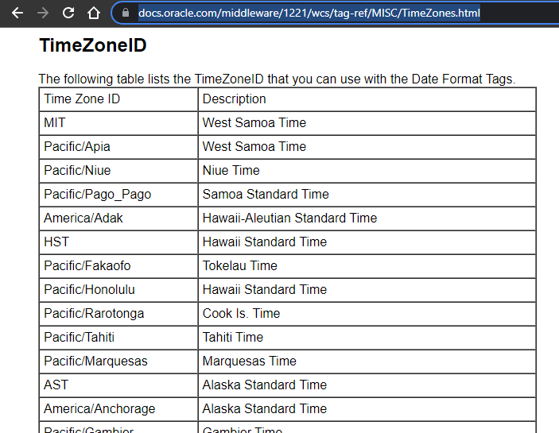
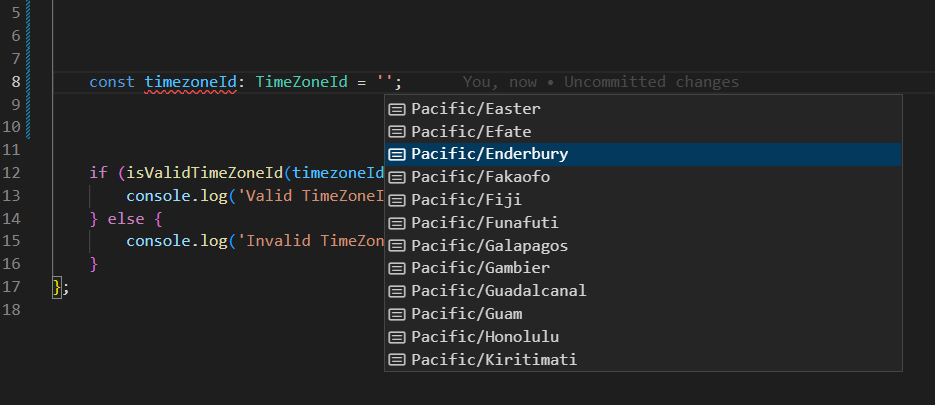
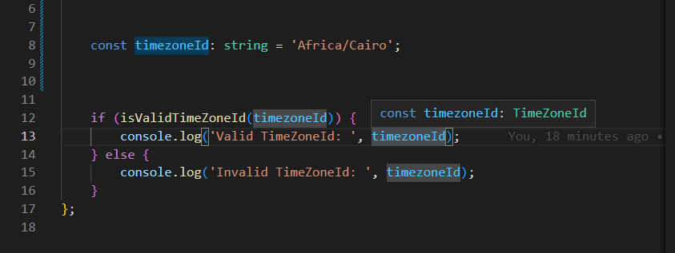

# Table of contents

- [Table of contents](#table-of-contents)
- [See also](#see-also)
  - [1. TimeZoneID from oracle](#1-timezoneid-from-oracle)
  - [2. Download TimeZone Ids as json](#2-download-timezone-ids-as-json)
- [API](#api)
  - [1. TimeZoneId](#1-timezoneid)
  - [2. timeZoneIds](#2-timezoneids)
  - [3. isValidTimeZoneId](#3-isvalidtimezoneid)


# See also
## 1. TimeZoneID from oracle

[https://docs.oracle.com/middleware/1221/wcs/tag-ref/MISC/TimeZones.html](https://docs.oracle.com/middleware/1221/wcs/tag-ref/MISC/TimeZones.html)



## 2. Download TimeZone Ids as json
[Download: https://github.com/tuannguyen7326/timezone-ids/blob/main/dataset/timezoneids.json](https://github.com/tuannguyen7326/timezone-ids/blob/main/dataset/timezoneids.json)

```json
{
    "timezoneIds": [
        "ACT",
        "AET",
        "AGT",
        "ART",
        "AST",
        "Africa/Abidjan",
        "Africa/Accra",
        "Africa/Addis_Ababa",
        "Africa/Algiers",
        "Africa/Asmera",
        // ...................
        "Pacific/Tarawa",
        "Pacific/Tongatapu",
        "Pacific/Truk",
        "Pacific/Wake",
        "Pacific/Wallis",
        "SST",
        "UTC",
        "VST",
        "WET"
    ]
}

```


# API
## 1. TimeZoneId



```ts
export type TimeZoneId =
    | 'ACT'
    | 'AET'
    | 'AGT'
    | 'ART'
    | 'AST'
    | 'Africa/Abidjan'
    | 'Africa/Accra'
// .............
    | 'Pacific/Wake'
    | 'Pacific/Wallis'
    | 'SST'
    | 'UTC'
    | 'VST'
    | 'WET';
```


## 2. timeZoneIds
```ts
import { TimeZoneId } from './types';

export const timeZoneIds: Readonly<TimeZoneId[]> = Object.freeze([
    'ACT',
    'AET',
    'AGT',
    'ART',
    'AST',
    'Africa/Abidjan',
    'Africa/Accra',
// ..........................
    'Pacific/Tongatapu',
    'Pacific/Truk',
    'Pacific/Wake',
    'Pacific/Wallis',
    'SST',
    'UTC',
    'VST',
    'WET',
]);

```

## 3. isValidTimeZoneId



```ts
import { TimeZoneId, isValidTimeZoneId } from 'timezone-ids';

const timeZoneId: string = 'Africa/Accra';

if (isValidTimeZoneId(timeZoneId)) {
    console.log('Valid TimeZoneId: ', timeZoneId);
} else {
    console.log('Invalid TimeZoneId: ', timeZoneId);
}

```